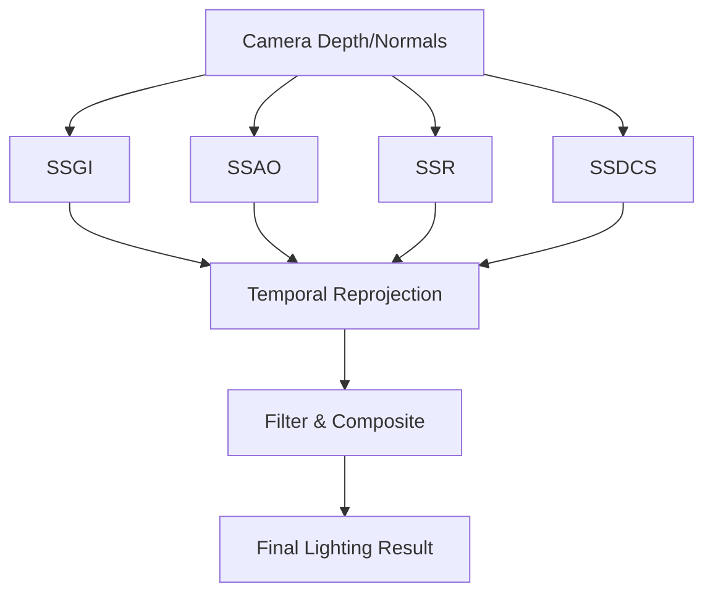
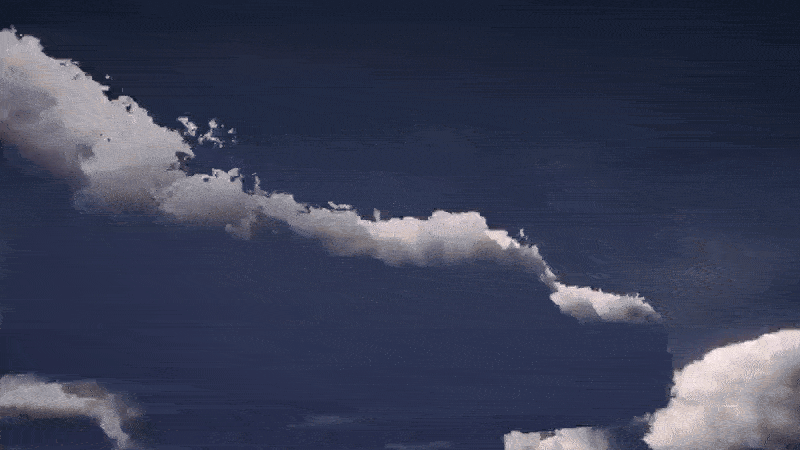
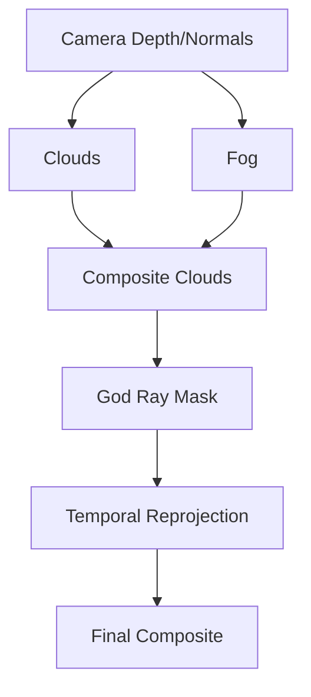
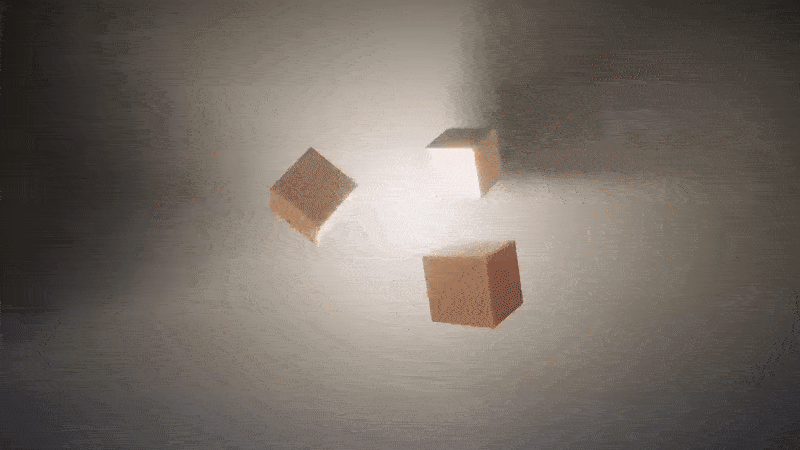
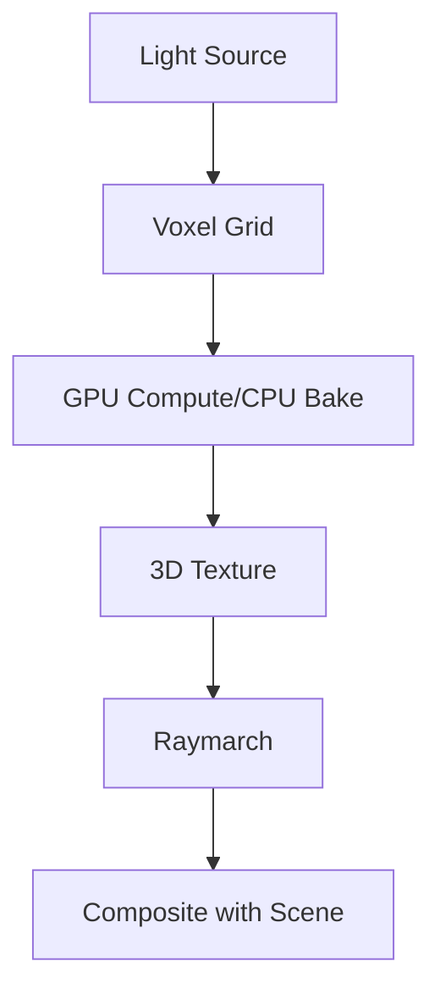
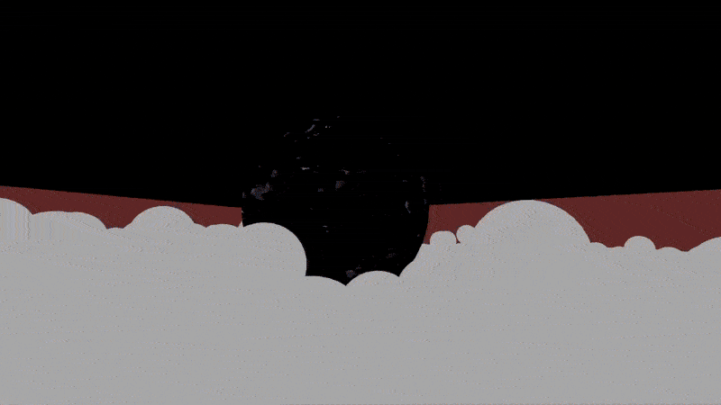
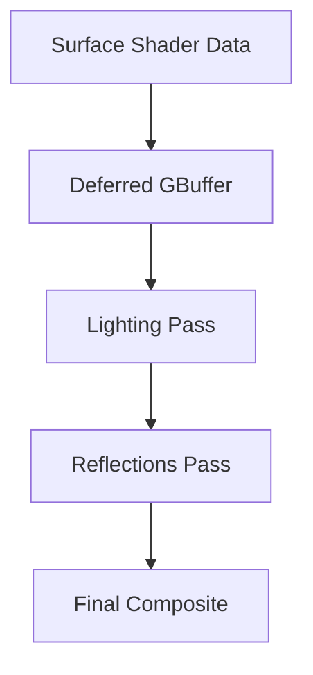

# Ymne LightingFX (Unity BRP)

## ⚠️ Important
These rendering systems are optimized and tested with **Vulkan**.  
Some features (especially voxel lighting and temporal reprojection) may behave incorrectly or fail under **DirectX 11/12**.  
Please **switch your Graphics API to Vulkan** in **Project Settings → Player → Other Settings**.

---

## Summary
A collection of advanced rendering effects and shaders for Unity’s **Built-in Render Pipeline (BRP)**.  

Includes:  
- **Lighting Stack** – SSGI, SSAO, SSR, SSDCS  
- **Volumetric Atmosphere** – clouds, fog, and god rays  
- **Voxel Volumetric Light** – per-light volumetric scattering with voxelization  
- **Shadow CSM Settings Shader** – soft shadows with rotated Poisson disk sampling  
- **PBR GGX Forward/Deferred Shader** – forward for full version, and deferred-capable materials with POM, emission, rim, and SSS  

---

## Lighting Stack

SSGI and SSAO Preview

  

SSR Preview

  

### 1. Screen-Space Global Illumination (SSGI)

- Screen-space diffuse bounce lighting  
- Adjustable **sample count**, **ray distance**, and **thickness**  
- Temporal reprojection for stability  
- Gaussian filtering for smooth results  

---

### 2. Screen-Space Ambient Occlusion (SSAO)

- Hemisphere sampling with controllable **radius** and **power**  
- Optional temporal reprojection  
- Depth & normal-weighted filtering to reduce noise  

---

### 3. Screen-Space Reflections (SSR)

- Raymarching reflections with adjustable **distance** & **thickness**  
- Roughness-based contrast for glossy vs. rough surfaces  
- Temporal reprojection for stability  
- Gaussian blur for denoising  

---

### 4. Screen-Space Directional Contact Shadows (SSDCS) - Experimental Read warning attached shader

- High-frequency contact shadows  
- Directional light–aware (uses main scene sun)  
- Adjustable **thickness**, **intensity**, and **filter radius**  
- There's still lot of limitation on this implementation, do not use it on final product

---

### 5. Temporal Reprojection
- Shared reprojection buffer for all effects  
- Adjustable **blend factor**  
- History reset on camera jumps  

---

**Processing Flow**:

---

## Volumetric Atmosphere

Volumetric Clouds Preview

  

### 1. Volumetric Clouds

- Raymarched cloud layers with coverage, density, and detail noise  
- Animated via **wind speed**, **direction**, and **morphing**  
- Lighting options: absorption, self-shadowing, silver lining  

---

### 2. Global Volumetric Fog

- Height-based exponential fog  
- Day/Night blending via sun angle curve  
- Independent settings for day and night (color, density, glow)  
- Optional skybox integration  

---

### 3. God Rays

- Volumetric light shafts from the sun  
- Adjustable **sample count**, **intensity**, **color**, and **decay**  
- Temporal reprojection for smooth results  

---

### 4. Distance & Curvature
- Planet radius parameter for horizon bending  
- Distance-based fade for performance  

---

**Processing Flow**:

---

## Voxel Volumetric Light

Voxel-Volumetric Light

  

### 1. Overview

- Voxelized volumetric scattering for **point** & **spot** lights  
- Supports **baked** and **realtime** update modes  
- Runs on **GPU compute shaders** (CPU fallback available)  

---

### 2. Update Modes
- **Baked**: precomputed 3D texture for static lights  
- **Realtime**: updates voxel volume dynamically  
  - *Every Frame*  
  - *Time-Sliced*  
  - *On Enable*  

---

### 3. Visual Controls
- Density, extinction, falloff exponent  
- Anisotropy & sharpness controls  
- Proximity boost & brightness multipliers  

---

### 4. Noise & Detail
- 3D noise modulation for turbulent shafts  
- Adjustable scale, velocity, octaves, and intensity  

---

### 5. Performance
- Configurable voxel resolutions (16–1024³)  
- Adjustable raymarch step count  
- Smooth filtering toggle  

---

**Processing Flow**:

---

## Shadow CSM Settings Shader

### Overview

- Configurable in **Graphics → BRP Shader Settings**  
- **Soft shadows** via rotated Poisson disk sampling  
- **Cascade blending** for smooth transitions  

---

## PBR GGX Deferred Shader

Ymne PBR on Deferred Pass

  

### Overview

- Deferred-capable version of the forward PBR shaders  
- Requires in **Graphics → BRP Shader Settings**:  
  - `DeferredReflectionsSettingShader`  
  - `DeferredLightingSettingShader`  

---

### Features
- GGX BRDF with metallic/roughness workflow  
- POM with self-shadowing  
- Detail albedo & normal maps  
- Emission, rim lighting, prediction-based subsurface scattering  
- Cutout transparency support  

---

### Limitations vs Forward
1. No **Specular Anti-Aliasing**  
2. Rim & Subsurface Scattering are **approximate**
3. No **anisotropy specular**  
4. Limited pass budget → some advanced effects excluded  

---

**Shader Flow**:

---

## Sample Scenes

- **SampleScenes_LightingStack** – demonstrates GI, AO, SSR, SSDCS, and shadows  
- **SampleScenes_VoxelLight** – voxel lighting

---

## License
This project is licensed under the **MIT License**.  
Use it freely for learning, modification, or integration into your own projects.  
